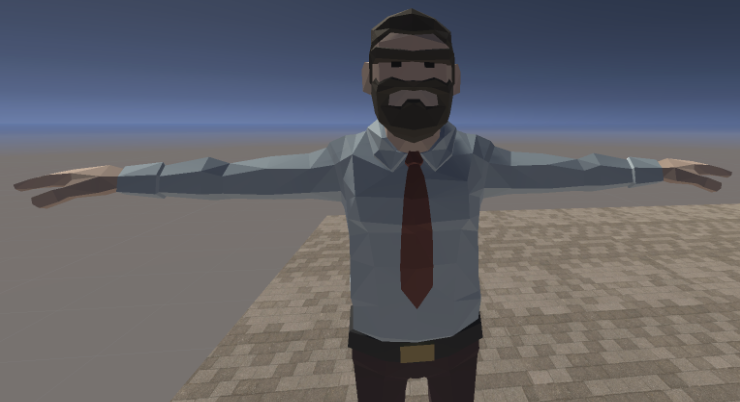

  

# Game Overview

## Core Concept and Genre :video_game:
**The Last Man Standing** is a 2.5D Hack & Slash, time survival game where players are pitted against ruthless hordes of zombies. Armed with an array of guns and explosives, players confront diverse zombies to withstand before the rescue. Additionally, they have the option to construct shelters or obstacles, further enhancing their chances of survival against the undead. 

## Inspirations :sparkles:
**The Last Man Standing** draws its inspiration from a renowned Hack & Slash game Vampire Survivors (2021). This game has significantly influenced the game's dynamic combat mechanics.
Furthermore, the game's progression, atmospheric tonality, and thematic essence find their roots in the iconic zombie film I Am Legend (2007). The film's portrayal of a post-apocalyptic world and the challenges faced by the last remaining survivor have provided the foundational inspiration for shaping the general flow, mood, and thematic elements of **The Last Man Standing**.

## Target Audience :dart:
The game's intended audience is enthusiasts of the Hack & Slash genre, aged 15 and above due to its mature content involving unrealistic depictions of blood and physical violence. 

## Unique Selling Point :fire:
The Unique Selling Point of **The Last Man Stand** is that it keeps the fast-paced excitement of the Hack & Slash genre while letting players build their own shelters or obstacles allowing for creative thinking when playing the game. This freedom allows players to create unique defensive strategies against the undead. 

# Story and Narrative
Since the game’s genre is Hack & Slash, the game is not narrative-driven, rather it focuses on the exhilarating and suspense-filled actions the player takes.

## Backstory :book:
Steve wakes up in the city, and it's quiet. The hustle and bustle is replaced by eerie silence. Everyone's dead, soldiers and all, only leaving behind a bunch of bodies scattered around Steve. Steve grabs a military radio from a dead soldier and makes contact with the command centre. He asks for help, and they promise to rescue him within 5 minutes. Steve's relieved, but then he hears something loud and aggressive heading his way. Turns out, it's a bunch of zombies making all that noise! Steve grabs whatever's lying around, including guns, and fights off wave after wave of these zombies. He's giving it all he's got until the rescue team rolls in.

## Characters :family_man_girl_boy:
Portrait            |  In-game
:-------------------------:|:-------------------------:
  |  

### Hero
Steve - A regular guy, minding his own business, suddenly finds himself in a tough spot, he's the only one left in the entire city. Without a clue about what happened, he uses his skills to break through the chaos and find a way out.

Zombie 1        |  Zombie 2  | Zombie 3 
:-------------------------:|:-------------------------:|:-------------------------:
  |    |   

### Villain 
Zombie - A hostile entity relentlessly attacks Steve.

# Gameplay & Mechanics

The game consists of alternating battle phases and preparation phases.

### :sparkles: Ultimate Goal :sparkles:
The ultimate goal is to endure until the arrival of the rescue team, signaled by a helicopter. While there's no visible timer, The rescue team will regularly tell the player how close they are using the radio.

### Preparation:
Players can use preparation time to employ new weapons and construct shelters or obstacles to prepare for the upcoming battles.

### Battle Phase:
The quantity and quality of enemies escalate as time goes by! Additionally, the entry points for zombie hordes become more diverse, intensifying the attacks and adding an element of unpredictability. 

### Rescue:
If Steve successfully survives all the battles, a rescue helicopter arrives to pick him up, and the game finishes.

  

At first, Steve is spawned at the centre of the map,

  

and soon after zombies will approach from various directions, all Steve has to do is to kill & survive!

## Player Perspective :eyes:

  

The game employs a dynamic 3rd person perspective with a top down camera angle. The controls of the character are straightforward.

<kbd>W</kbd> <kbd>A</kbd> <kbd>S</kbd> <kbd>D</kbd> Move Steve

<kbd>mouse</kbd> Shoot, Rotate and Aim

<kbd>shift</kbd> + <kbd>W</kbd> <kbd>A</kbd> <kbd>S</kbd> <kbd>D</kbd> Run

<kbd>G</kbd> Throw explosives

<kbd>1</kbd> ~ <kbd>6</kbd> Swap around item slots

## Progression :chart_with_upwards_trend:
Steve's health decreases when subjected to zombie attacks, and there's a possibility of self-inflicted harm resulting from explosives. Steve dies if the health reaches zero. Steve will also be able to run, increasing his speed and enabling him to dodge enemies and move throughout the map quicker. However, this decreases his stamina bar and when his stamina reaches 0, he won't be able to run until he regains it back. As the game progresses, various weapons, zombie types, and items become accessible gradually. Additionally, multiple difficulty levels will be provided for players to choose from. This prompts players to want to keep playing.

## Player strategies :boxing_glove:
The primary strategy available to the player revolves around acquiring diverse items to enhance their strength. The player can secure items such as projectile weapons, explosives, traps, obstacles and edibles via two different methods: eliminating enemies (with a certain probability of item drops) or discovering items scattered randomly across the map.

  

### Weaponries:

* At the beginning, the player is equipped with the game's most fundamental weapon: a pistol. By pressing the spacebar, the player can shoot into the direction they are facing, it’s weak but the ammo is unlimited.
* Equip new weapons/objects by pressing E, the player can swap around them by pressing number keys, every projectile weapon has to be reloaded, making it more challenging for the players.
* Destroy nearby objects(oil drums, etc.) to inflict splash damage on the zombies. 
* Throw hand grenades or attach landmines to the entry point to effectively wipe out multiple enemies.

  

### Obstacles:

* Obstruct the entry point or construct a protective barrier around the character using obstacles. This strategy will decelerate enemy movements and diminish the impact of zombie attacks.

  

### Edibles:

* The player can recover health or boost abilities by consuming edibles.

## Levels and World Design :globe_with_meridians:
Game Map
:-------------------------:

The game is presented in a dynamic 3rd person 2.5D perspective, it takes place on a single-leveled urban city-themed map, with the screen shifting automatically to follow Steve's movements. 

The game world has different objects. Some objects like buildings and trees always stay in the same place. Other things like barricades and barrels appear randomly every time you start the game. This means the map is always different when you play. Some objects like barrels can be broken using explosives or by shooting them. There are two different types of objects that spawn randomly throughout the map. The first type are objects that have a rigid body and are interactable. These objects can spawn anywhere within the map and act as an obstacle for the player or could be used as a throwing weapon as well. The second type is static objects that aren't interactable and act as decorations or props that contribute to the atmosphere of the game. Both types of objects are handled differently using different C# scripts dedicated to object spawning. 

## Art and Audio :art:

### Art Style:
The game will have an art style characterised by minimalist polygon shapes, similar aesthetics to the games shown below. 

Risk of Rain 2         |  Deep Rock Galactic  | Super Hot | Human Fall Flat
:-------------------------:|:-------------------------:|:-------------------------:|:-------------------------: 
  |   |  | 

### Sound and Music:
The sound design of the game will mostly consist of eerie sound effects, and suspenseful music will be used to emphasise on the suspense and tension in the game. 

### Assets:
* https://assetstore.unity.com/packages/3d/environments/polygon-sampler-pack-207048 (Steve)
* https://assetstore.unity.com/packages/3d/characters/zombie-lowpoly-character-118663 (Zombie)
* https://assetstore.unity.com/packages/3d/props/guns/low-poly-fps-weapons-lite-245929 (Weapon)
* https://assetstore.unity.com/packages/3d/environments/urban/city-package-107224 (City)
* https://assetstore.unity.com/packages/3d/props/food/low-poly-food-lite-258693 (Edibles)
* https://assetstore.unity.com/packages/3d/props/tools/survival-game-tools-139872 (Survivor Game Tool)
* https://assetstore.unity.com/packages/3d/props/weapons/3d-guns-guns-pack-228975 (Weapon)
* https://assetstore.unity.com/packages/3d/props/exterior/barricade-652 (Barricade)
* https://assetstore.unity.com/packages/3d/props/industrial/pbr-barrels-83508 (Barrel)

## User Interface :joystick:
### Main menu:

  

### Gameplay:

  

&#9312; Health bar: Decreases when your character receives damage

&#9313; Score: Increases when your character kills enemies

&#9314; Item slot: Select the item to use, and swap around by pressing the number keys

## Technology and Tools :hammer_and_wrench:

* Unity
* Github
* Google document(Collaboration)
* Unity Probuilder(Map design) - Version 5.1.1
* Audacity(audio editing) - Version 3.3.3

## Team Communication, Timelines and Task Assignment :hourglass_flowing_sand:

We've split our project into 3 big sections: map development, character interactions, and weaponry/obstacles development. We’ll divide each section into more detailed subsections and then delegate them to each member. Everyone is responsible to finish their task by the deadline, and we'll keep track of everything on Monday.com. 
We will use Discord for communication and we’ll have an online Discord meeting once a week, also since everyone is available on Tuesday afternoon, we’ll meet up in person to talk about the progress in depth.

## Possible Challenges :skull:
The challenges we discussed are:

1. It's difficult to make the game feel tense for players.
 
- Make the zombie movement dynamic to make them threatening.
- Use a dark setting (like nighttime) to make the game feel more spooky.
- Use sound effects effectively to build up tensions.

2. Implementing a diverse range of weaponry in a limited timeframe is challenging.

- Efficiently assign responsibilities to team members to optimise productivity, always keeping the deadline in mind.
- In cases where certain weapons are too complex or time-consuming, adjust the design plan after discussion.

## References :link:
- https://www.figma.com (Interface Design)
- https://ezgif.com (Gif)
- https://dezgo.com (Character Portrait Generation AI)
- https://picfont.com (Game Title)
