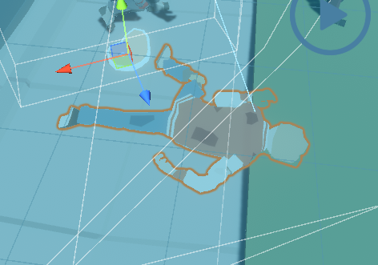
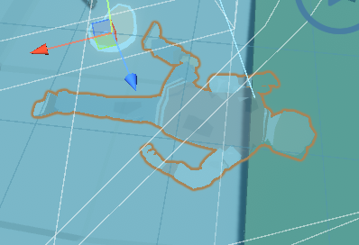
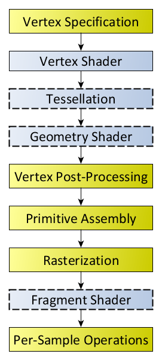

# Project 2 Report

Read the [project 2
specification](https://github.com/COMP30019/Project-2-Specification) for
details on what needs to be covered here. You may modify this template as you see fit, but please
keep the same general structure and headings.

Remember that you must also continue to maintain the Game Design Document (GDD)
in the `GDD.md` file (as discussed in the specification). We've provided a
placeholder for it [here](GDD.md).

## Table of Contents

* [Evaluation Plan](#evaluation-plan)
* [Evaluation Report](#evaluation-report)
* [Shaders and Special Effects](#shaders-and-special-effects)
* [Summary of Contributions](#summary-of-contributions)
* [References and External Resources](#references-and-external-resources)

## Evaluation Plan

### Evaluation techniques

For our evaluation, we can use the think-aloud technique since it provides real-time insight into a participant’s thought process; we can quickly receive feedback and identify aspects of gameplay that need improvement.

We also use questionnaires as a structured way of gathering participant feedback by quantifying user satisfaction, gameplay mechanics, etc. Thus, granting us the ability to capture a broader audience; giving us a diverse range of feedback, and potentially discovering areas of improvement that only numeric data can provide.

### Participants

For our recruitment process, we could find friends, family, and classmates who have an interest in games similar to Box Heads with a rogue-lite twist as well as others who have no experience in gaming, thus making our feedback more well-rounded ensuring that our game caters both new players and experienced gamers.

### Data collection

For our data collection, we will use qualitative and quantitative data to give us a comprehensive view of the player experience. During the think-aloud process, we will take notes of the choices, interactions, and challenges they encounter during the session, and also follow-up questions about their overall experience of the game or questionnaires that ask participants to rate different aspects of the game. We can take notes physically or use Google Docs to take down the participants' experience during the think-aloud process and use Google Forms for our questionnaires.

### Data analysis

For our qualitative data, we could gather all the feedback and use thematic analysis e.g. UI, gameplay, and graphics to identify common problems in each area. Still, we could also summarise key findings of common challenges faced by players and any gameplay aspects that could contribute to the confusion of participants' ability to finish the game.
For our Quantitative data, we could use Excel or Python to visualise patterns/trends within the dataset.

### Timeline

- 1st Week (Oct 9th - Oct 15th): Finalise tasks, prepare testing setup, and send out invitations for game testing.
- 2nd Week (Oct 16th - Oct 20th): Host game testing sessions, collect data, and begin preliminary analysis.
- 3rd Week (Oct 23rd - Oct 31st): Complete data analysis, identify key areas for improvement, and start implementing changes to the game.

### Responsibilities
Initially, we will have two members focus on ongoing project tasks, while the other team members will handle the evaluation and after a while, we will switch roles to ensure that all members contribute equally to the project and evaluation during this period.

## Evaluation Report

Our evaluation primarily involved participants to actively play the game, allowing us the record/comment on their initial impressions of the playing. Based on the feedback from their first impressions participants commented on some gameplay mechanics that caused some confusion such as the ability to shoot and the functionality/ability of items/edibles that they picked up. Additionally, some participants wished for more movement/be more mobile to navigate through the map as movement was limited.
On the user interface/graphics aspect, participants found that the design/interface was intuitive to understand, they found some difficulty when the player takes damage from enemies. Feedback from our questionnaires suggested that participants had a varied overall experience/enjoyment from our game, with ratings spread across the spectrum.

### Changes based on feedback

In response to the feedback given by participants, we will make several adjustments to our game to make it more enjoyable.
- Provide clear descriptions of how the edibles/items work in game using text based implementation.
- Adjust the action of shooting from space to the left mouse button for a more intuitive experience.
- Introduce stamina mechanic to provide players with the addition of sprinting so participants can have more control over their gameplay.
- Introduce visual cues such as the screen edges turning red to provide feedback when the player gets damaged/hit.

Through these changes to the gameplay and graphics of our game, we aim to address some key concerns suggested by participants so that they can have a more enjoyable experience with our improved game.

## Shaders and Special Effects

There are three fully custom-made, nontrivial shaders within the game. One of them is a surface shader used for creating the glowing and pulsing effect for the various weapons and edibles in the game. The other two are vertex and fragment shaders used for camera post effects (mostly for attacked vignette effects) and object decay. The two fragment and vertex shaders are the ones that we wish to be marked and are also the ones that are to be discussed in this report. Note that these shaders are created with the assistance of YouTube tutorials and web resources which include the [OpenGL Wiki](https://www.khronos.org/opengl/wiki), [Unity Documentation on Shaders](https://docs.unity3d.com/Manual/Shaders.html), [Benjamin Swee](https://www.youtube.com/@benjaminswee-shaders) and [Dapper Dino](https://www.youtube.com/@DapperDinoCodingTutorials).

### Post Effects Shader 

[(LINK) Post-Effects Controller C# File](https://github.com/COMP30019/project-2-random/blob/main/Assets/Shaders/Post%20Effects/PostEffectsController.cs)

[(LINK) Post-Effects Shader](https://github.com/COMP30019/project-2-random/blob/main/Assets/Shaders/Post%20Effects/%5BCUSTOM%5D%20PostEffects.shader)

The role of post-effects is to manipulate the source render texture coming from the game's main camera. When the main camera renders an image, it goes through one texture referred to as the render or source texture. A post-effects script is applied to the main camera as a means of acquiring the source render texture, manipulating it through a shader, and putting it back on the screen. Specifically, the post-effects controller creates a new material at the start and that material uses the post-effects shader. The controller is also responsible for setting up the parameters in the shader. 

The post-effects shader is an unlit shader with two different passes. Pass 0 passes a simple screen tint effect with the color being a parameter set by the controller. This effect is used for testing purposes and is not used in-game. Pass 1 passes a vignette effect and uses radius, feather, and screen tint as parameters for adjusting the vignette effect. This shader works by creating a UV that implements a circle onto the screen. A mask is then created to invert that UV and apply a feathering effect using a smooth step function. The screen tint is then applied to the mask and it is returned. 

The controller sets the feathering effect of the shader which determines the solidity of the vignette effect. The radius is also set as a means of setting the size of the effect on the screen. Screen tint is set to adjust the color of the effect and the effect type is also set which determines what is being passed on by the shader. The implementation of this shader and the post-effects system more generally is during the moments when the player is attacked by Zombies. When that occurs, the reveal value of the vignette will be increased and decreased during a set time period that is all set by the controller. This animated vignette will play every time the player is attacked as a means of communicating to the user that the player has taken damage. Note that the set parameters in the controller are all serialized as a means of adjusting these values for testing purposes directly. 

Unfortunately, post processing is only compatible with certain web browsers depending on the Operating System since there are issues pertaining to webGL. On MAC, the shader is not compatible on Safari but is compatible with Chrome and Firefox. On Windows, it is not compatible on Chrome but is compatible on Firefox. Only these three web browsers were tested and it seems as though the issue lies within compatibility issues pertaining to post processing and webGL. When running the webGL build, sever errors appeared on the browser console stating that the post processing shader is not compatible with the GPU. As such, a compromise was reached to create options for the player. It is assumed that the player is running this build on Chrome and if the player uses a Windows machine, then the shader is deactivated when choosing that option from the main menu. If the player is running on a MAC, the shader will be activated. Note that the shader does function when using Firefox on Windows, thus, if the player is using that web browser, they could choose the MAC option and still be able to play the game with the post-processing shader applied. This compromise is to allow for players who are able to play the game with the shader applied to still do so instead of removing the shader completely. 

### Object Decay Shader

[(LINK) Object Decay Shader](https://github.com/COMP30019/project-2-random/blob/main/Assets/Shaders/Miscellaneous/%5BCUSTOM%5D%20ObjectDecay.shader)

[(LINK) Zombie Melee Controller](https://github.com/COMP30019/project-2-random/blob/main/Assets/Scripts/ZombieScripts/ZombieMeleeController.cs)

[(LINK) Zombie Ranged Controller](https://github.com/COMP30019/project-2-random/blob/main/Assets/Scripts/ZombieScripts/ZombieRangedController.cs)

[(LINK) Game Over Manager](https://github.com/COMP30019/project-2-random/blob/main/Assets/Scripts/GameOverManager.cs)

The object decay shader uses blending properties, masking, and the implementation of step and smooth step functions to create an erosion effect, allowing the object to look like it is decaying. In the shader file, there are two texture properties, with one being the main (base) texture and the other being the masking texture. The idea is that the masking represents the transparent sections of the surface, where these areas are the white areas in the texture. This is done by having the alpha of the main texture be multiplied against the mask texture. To have the mask "reveal" the underlying main texture, a step function is used to present a reveal value property that determines how much of the underlying texture is shown by the mask. Essentially, the black regions of the mask are the first ones that get revealed and as the reveal value property increases, the whiter regions of the mask start to get revealed. But the reveal effect is too hard or solid. Introducing a type of blending, feathering or smoothness to the effect is desirable as a means of avoiding this hardness. A feathering value property is then added to the shader to facilitate this. To implement this feathering effect, the step function is changed into a smooth step function which is able to smoothly interpolate between two input values based on a third input value. In this case, the third value is the reveal value with the first and second input values being the lower and top feathered amount for the mask respectively. This results in a smooth erosion effect where the reveal and feathering values are properties that can be set and adjusted via C# scripts. 

 
The Worley texture shown on the left is used as the mask for the shader. A noise function called the Worley noise is used to generate the texture and is commonly used for modeling volumetric clouds. In this case, it is suitable for being the mask texture for the shader since the black and white regions of the texture are such that it would create a "realistic" decay pattern.      

There is an option added to further stylize this effect by adding color to the erosion. This is done by replacing the smooth step function with two separate step functions which are respectively used for the upper and lower range for the effect. The idea is to retrieve the difference between the mask when feathering is added to it and subtracted from it. This difference or the space between the two feathered masks (the white region between the two masks with applied feathering) will then be multiplied against color to create a colored erosion effect. The smooth step function is not used in this case since it will result in the reveal difference having a smooth outline that does not look appropriate. An erode color property is introduced as a means for a separate C# script to set and change the color of the decay effect. It is also possible to toggle between the erosion color effect and the normal erosion effect via the decay effect property. This will allow for greater flexibility when it comes to the implementation of the shader as it is applied to various objects in the game.

The main implementation for this shader pertains to zombie decay, where during the death animation for a zombie, a C# script will change the reveal parameter in the shader of the material possessed by the zombie and it will start to decay as shown in the images below. The normal decay effect is used for this implementation since the asset used for the zombie is not compatible with the colored erosion effect (the erosion results in a sudden and not gradual decay, creating an abnormal and unsuitable effect). The zombie melee and ranged controllers are responsible for changing the shader parameters and said parameters are changed as soon as the zombies have <= 0 health and the death animation begins. 

High Reveal       |  Mid Reveal  | No Reveal
:-------------------------:|:-------------------------:|:-------------------------:
  |    |   

The revealValueIncrement parameter in the zombie controllers is used as the value that is subtracted from the reveal value parameter of the shader every time the update method is called. This allows for the gradual decay animation of the zombies and results in a decay effect. There are also other parameters that set the initial shader, final object decay shader as well as the constant properties that pertain to both shaders such as underlying or main texture and attributes pertaining to the blood effect in the initial surface shader. There was testing done to see if it was viable for randomizing the offset and scaling of the underlying zombie and blood textures as well as blood color, but it resulted in a look that did not suit the style of the game that was proposed in the GDD. It was not implemented in the final product but was still kept as an option in the script for testing purposes. 

 
The GIF on the left shows the zombie shader in action where the model starts to decay when its death animation starts playing. When there is no reveal, it is then destroyed from the game.            

There are a few issues present with this implementation that pertain to the assets being used. The initial shader used for the zombies is an asset surface shader and the contents of said shader are incompatible with the desired erosion effect. As such, when the zombie dies, this shader has to be switched with the decay shader, which results in the texture of the zombie changing as well considering the effects from the initial surface shader are no longer applied. This results in an abnormal switching effect. There is also an issue where a glowing effect replaces the underlying main texture of the shader, causing the zombie to glow when it starts dying. These issues again stem from the incompatibility with the imported assets, but these issues play a minor role in presenting the desired effect of object decay and do not diminish the experience of the player. That is why the shader is still implemented in this way. 

Another implementation of the shader is for the game over screens where both the colored erosion effect and normal erosion effect were utilized. The game-over manager C# script is responsible for setting and changing the reveal and color properties of the shader. The type of game over-screen animation that plays is random and there is a 50% chance of either one being played. In the case of this implementation, a loop is required to increase and decrease the reveal property of the shader. The attributes initialReveal and revealLimit are used as the floor and ceiling of the reveal values. When these values are reached, the revealChange goes from adding to to subtracting from the reveal properties and vice versa. This is done until the player clicks on the UI button to go back to the main menu. 

Engine            |  In-game
:-------------------------:|:-------------------------:
  |  

Engine            |  In-game
:-------------------------:|:-------------------------:
  |  

The following GIFS shows the shaders in action in-game. Note that the color of the text is changed as well for the final product as the initial look of black text blends in too much with the background for the colored erosion effect.

Type 1            |  Type 2
:-------------------------:|:-------------------------:
  |  

Note that another shader called the [standard-emissive shader](https://github.com/COMP30019/project-2-random/blob/main/Assets/Shaders/Glowing/%5BCUSTOM%5D%20Standard-Emissive.shader) was also custom created to apply a glowing effect on weapons and edibles. This effect is done using a surface shader and pulsing is also applied via the emission parameter in order to create a pulsating glow effect. This was done to communicate to the player that a weapon or edible is interactable. 

 
Both of these shaders are unlit shaders that utilize the fragment shader stage of the rendering pipeline as shown in the diagram on the left (credit to Khronos and OpenGL Wiki). Each sample of the pixels covered by the primitive will have a fragment generated and the fragment shader allows for each pixel to have the color defined. This allows for modifying image properties in the render window and in both shaders, the implementation results in the utilization of feathering, revealing (changing the alpha component of colors) using step and smooth step functions, changing RGB components of colors using multiplication and masking by introducing a new texture layer. All of these are done during this stage in the render pipeline and are all used to allow for more stylized effects which enhances the graphics, resulting in a better player experience.          

### Particle Systems

The game features a particle system that simulates the billowing smoke and residue left behind by a hand grenade explosion.

## Summary of Contributions
[Lucas Chan](https://github.com/lucaschanzx) - Mainly worked on the codebase of the game, such as maintaining the codes, and fixing bugs, worked on logics on zombie spawning, worked on the game map, implemented sound fx into the game and also game music, continuously refining and polishing the game.

[James Nikolas Putradi](https://github.com/JoeyHammoth) - Object spawning system, stamina system, shaders, lighting, UI, polishing, GDD, shader report, enemy spawning, bug-fixing, inventory, QOL improvements.

[William Zhang](https://github.com/x4z3y) - Worked on the Drop loot system, edibles, Some Player, Zombie and U.I implementations, bug fixes as well as Evaluation plan and report.

[Sooyoung Jung](https://github.com/syj7421) - Primarily focused on Map Implementation and the codebase of the game; handling of game phase, zombie spawning, various guns and hand grenade, game UI, and scene transitions
